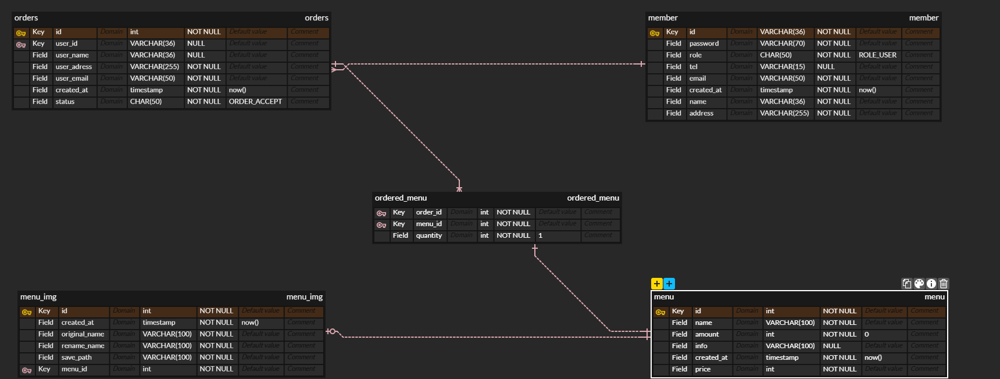

# 📦 NBE5-6-1-Team03

프로그래머스 백엔드 데브코스 5기 6회차 3팀의 1차 프로젝트입니다.

---

## 👥 팀원 소개

<table>
  <tbody>
    <tr>
      <td align="center"><b>정성연 </b></td>
      <td align="center"><b>정서윤</b></td>
      <td align="center"><b>박종욱</b></td>
      <td align="center"><b>김윤서</b></td>
      <td align="center"><b>김나단</b></td>
     <tr/>

<tr>
      <td align="center"></td>
      <td align="center"></td>
      <td align="center"></td>
      <td align="center"></td>
      <td align="center"></td>
     <tr/>

<tr>
      <td align="center"><a href="https://github.com/QuiteEasilyDone"><b>@QuiteEasilyDone</b></a> </td>
      <td align="center"><a href="https://github.com/yoozafree"><b>@yoozafree</b></a> </td>
      <td align="center"><a href="https://github.com/JongWook6"><b>@JongWook6</b></a> </td>
      <td align="center"><a href="https://github.com/yunseoy"><b>@yunseoy</b></a> </td>
      <td align="center"><a href="https://github.com/nathan960307"><b>@nathan960307</b></a> </td>
     <tr/>

  </tbody>
</table>

---

## 🛠 기술 스택

 
   
  
  
   
   

  
  
  
  
   

---

## 🗂 ERD

